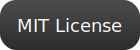

# <div align="center">Blink</div>

<div align="center">
  <strong>A Dual-Platform Project — Native macOS App + Modern Android App Foundation</strong>
</div>

<br />

<div align="center">



<br><br>
<a href="https://github.com/zakisheriff/Blink/releases/latest">

</a>
<a href="https://github.com/zakisheriff/Blink/releases/latest">

</a>
</div>

<br />

> **“Blink is not a simple app. It’s a refined dual-platform experience.”**  
>
> The macOS app embraces a premium **Liquid Glass** interface inspired by macOS 26, while the Android app provides a clean, modern foundation built in Kotlin. Blink delivers elegance on desktop and flexibility on mobile — both crafted natively and intentionally.

---

# ✨ What is Blink?

Blink is a **cross-ecosystem project** consisting of:

### **1. A Native macOS App (Swift + SwiftUI)**
- Liquid Glass UI  
- Native macOS 26 aesthetics  
- Smooth animations  
- Clean architecture  

### **2. A Modern Android App Template (Kotlin)**
- Lightweight skeleton  
- Clean structure  
- Ready for any app idea  
- Easy to extend and scale  

Blink is ideal for developers who want **both** a beautiful Mac app and a clean Android foundation under one project.

---

# 🛠 Technologies Used

### **macOS App**
| Tool | Purpose |
|------|---------|
| **Swift (5.9+)** | Core app logic |
| **SwiftUI** | macOS UI framework |
| **Xcode 15+** | Development IDE |
| **Apple Native Toolchain** | macOS app packaging + DMG |

### **Android App**
| Tool | Purpose |
|------|---------|
| **Kotlin** | Main app language |
| **Android Studio** | Main IDE |
| **Gradle** | Build system |
| **Java 17+** | Toolchain compatibility |

### General Tools
- Git  
- ZSH / macOS Terminal  
- GitHub Releases  

---

# 📂 Project Folder Structure

```
Blink/
├── macos/ # Native macOS App
│ ├── Blink.xcodeproj # Xcode project
│ ├── Blink/ # Swift source files
│ │ ├── Views/ # SwiftUI screens
│ │ ├── Assets.xcassets # App icons & assets
│ │ └── Utils/ # Helpers & extensions
│ └── Resources/ # App resources
│
├── android/ # Native Android app
│ ├── app/
│ │ ├── src/
│ │ │ ├── main/
│ │ │ │ ├── java/ # Kotlin code
│ │ │ │ └── res/ # Layouts, images, themes
│ │ └── build.gradle # App module Gradle
│ ├── gradle/ # Gradle config
│ └── build.gradle # Project Gradle
│
├── .gitignore
├── README.md
└── LICENSE
```


---

# 📥 Download & Install

You can test **both apps** right now:

### **🔵 macOS App**
1. Download the latest **DMG**:  
   👉 https://github.com/zakisheriff/Blink/releases/latest  
2. Open the `.dmg`  
3. Drag **Blink** into Applications  
4. Launch & enjoy the Liquid Glass UI ✨  

### **🟢 Android App**
1. Download the latest **APK**:  
   👉 https://github.com/zakisheriff/Blink/releases/latest  
2. Install it on your device  
3. Start using or extending the app  

---

# 🧑‍💻 For Developers

### macOS (Swift App)
```bash
git clone https://github.com/zakisheriff/Blink.git
cd Blink/macos
open Blink.xcodeproj
```

Then press Run (⌘ + R).

```bash
git clone https://github.com/zakisheriff/Blink.git
cd Blink/android
```

Open in Android Studio → Build → Run.

# 🌟 Vision

Blink’s purpose is to be:

- **A premium macOS app template** with world-class visuals  
- **A clean Android foundation** for any future application  
- **A multi-platform starter kit** for incredible apps  

# ☕️ Support the Project

If Blink helped you or inspired your next app:

<div align="center">
<a href="https://buymeacoffee.com/zakisherifw" target="_blank">

</a>
</div>

<p align="center"> Made with Swift, and Kotlin by <strong>Zaki Sheriff</strong>